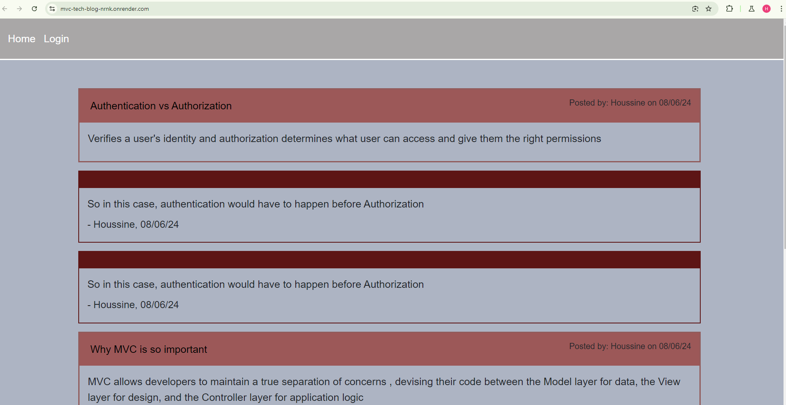
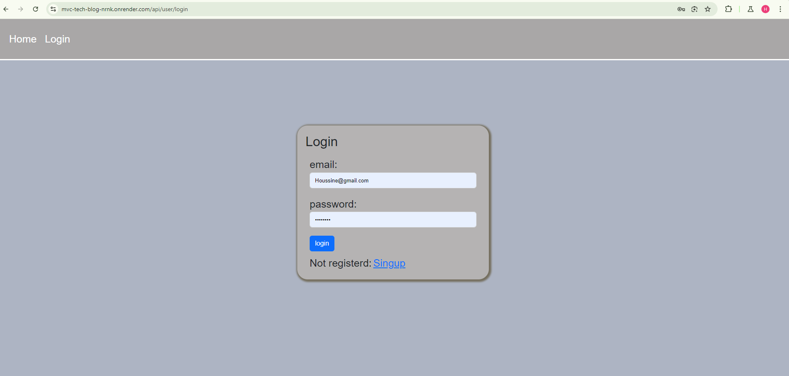
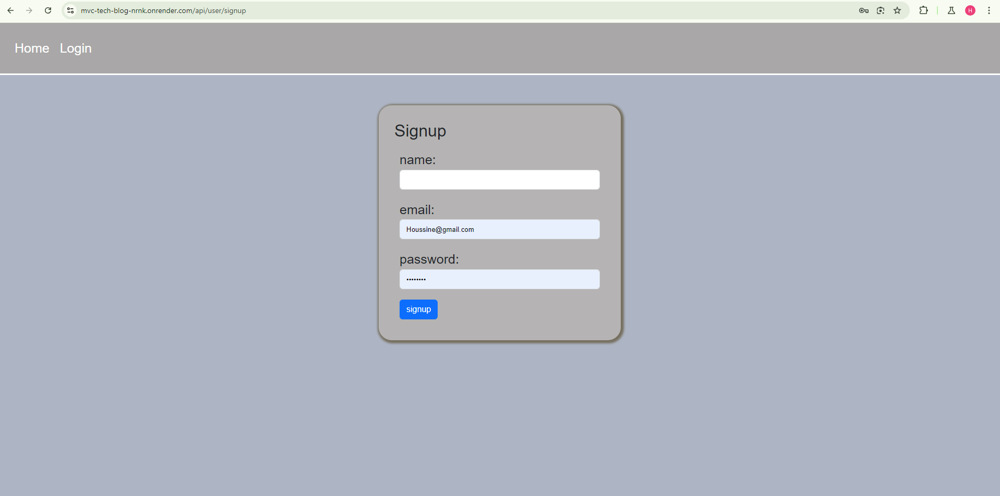
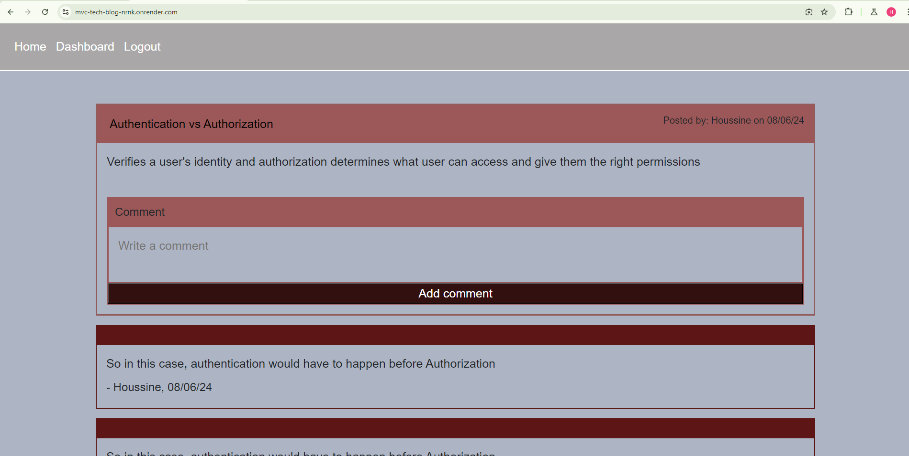
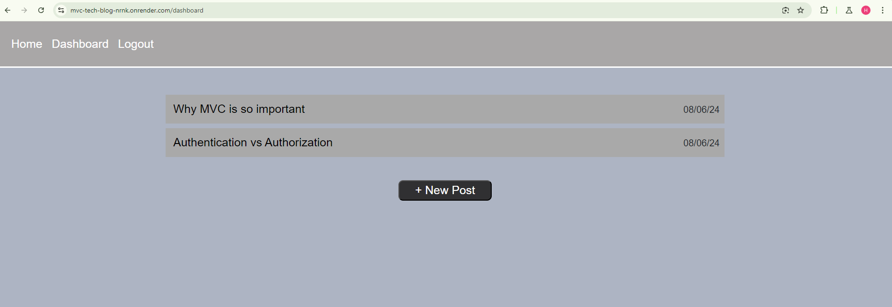
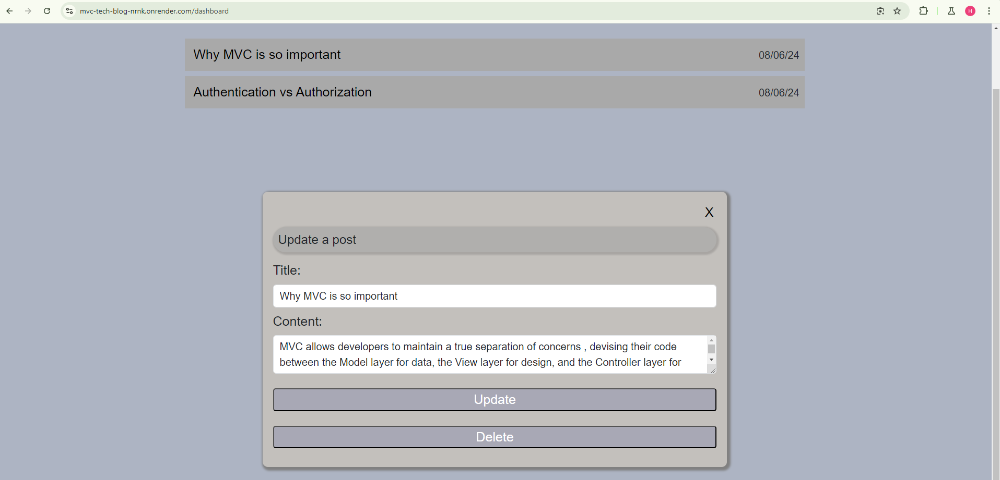
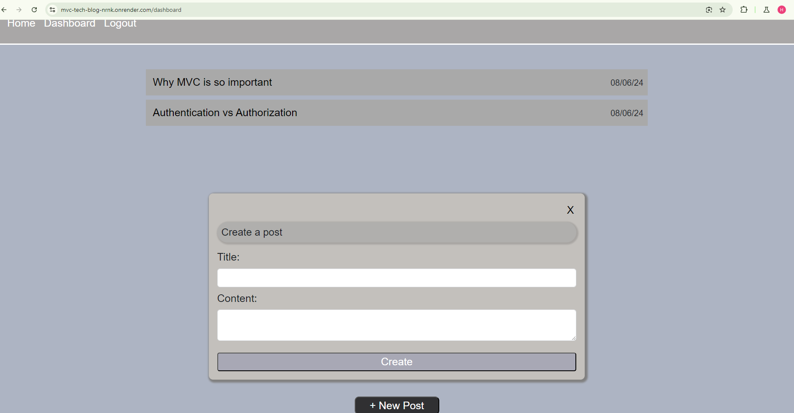

# the_tech_blog_MVC

     
## Description
This is a full stack site that uses crud operaiton to updated database and create new post and comment. The site, has 4 GUI pages, a page where user can sign in and another where the user signup. Home page showes all the post of all user, and other users can comment when they sign in. Dashboard page only availabe when the user is signed in, and it will show all the post that the current user create. It is also allows user to create, update or delete a post and its associated comments. 
## Tabel of Contents

* [Description](#Description)
* [Installation](#Installation)
* [Usage](#Usage)
* [License](#License)
* [Contributions](#Contributions)
* [Test](#Test)
* [Questions](#Questions)
    
## Installation 
    To install the packages that were used in this project please run the following command:
     npm i init

 ## Usage
   The site is a technology blog where user can post about topics they like and other user can comment to the topics. To create a post or comment to it, user must create an account. User also can delete or update the post from their dashboard when they signed in.

## License
    MIT

## Contributions
Please read the guideline provided in the github repo for the project

## Testing
There are not test available for this project

### Questions:

* For any question please use the following email address ekhay1@outlook.com
* Githab repository: ekhay-hit

## Visuals
* Deplyed URL: https://mvc-tech-blog-nrnk.onrender.com/
* ScreenShots:

